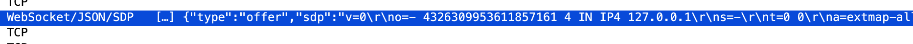
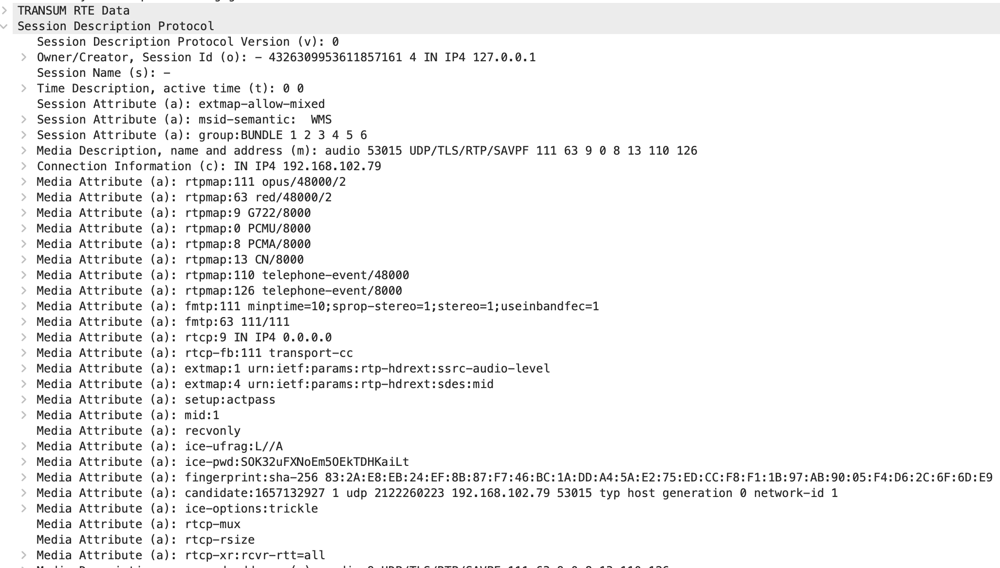

# wireshark_plugins
wireshark plugins created by me for training purposes

## plugins

### usb_keyboard_char_map.lua

When capturing USB packets in Linux from a keyboard, it 
extracts modifier, scan code and decoded key from "Leftover Capture Data" (usb.capdata) in the USB interrupt messages.

In order to see USB interfaces for capture in Wireshark run
```
sudo modprobe usbmon
```
These Items are shown in a subsection USB Keyboard Decoder at the end of the tree

The decoded key is also appended in the Info column

These is a sample capture usb-keyboard.pcapng to verify the function of the plugin.

> Plugin verified with capture on CPD3 laptop/Ubuntu analysed in Wireshark 4.6.2 on MacOS Tahoe

### webrtc-sdp-in-json.lua
When capturing WebRTC signaling via WebSocket in GoTo, the SDP is packed as a long string in a JSON object. The plugin hooks into the Websocket JSON dissector, finds the SDP element and call the regular SDP dissector on it, so that its shown nicely formatted in the packet details.
The protocol display in packet list is expanded to show  ```WebSocket/JSON/SDP```

#### Install
```Preferences → Protocols → WebSocket → Dissect websocket text as → JSON```.

Copy webrtc-sdp_in_json.lua into your _Personal Lua Plugins_ folder.

```Help → About Wireshark → Folders``` reload with ```Analyze → Reload Lua```

> Tested on MacOS Tahoe Wireshark 4.6.8 with capture done on Windows


#### Packet list



#### SDP Tree


